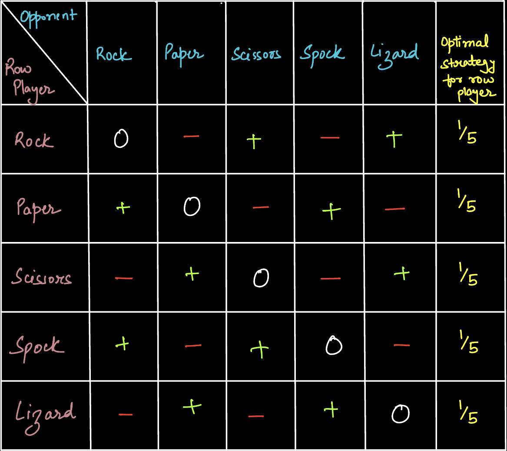

# KlerosExerciseRPSLS

First Exercise D: Rock Paper Scissor Lizard Spock

A web3 website to play this extended version of rock paper scissors. (See wikipedia article about [RPS and additional weapons](https://en.wikipedia.org/wiki/Rock%E2%80%93paper%E2%80%93scissors#Additional_weapons))

It should allow a party to create a RPS game. The first party creates the game, puts a commitment of his move, selects the other player and stakes some ETH.
The second party pays the same amount of ETH and chooses his move.
The first party reveals his move and the contract distributes the ETH to the winner or splits them in case of a tie.
If some party stops responding there are some timeouts.

Original RPS Smart Contract by Clesaege - [link](https://github.com/clesaege/RPS/blob/master/RPS.sol)

Website [RPSLSpock](https://rpsl-spock.vercel.app/)

### Build With

- React + JavaScript
- Solidity Smart Contracts (RPS.sol, RPSRegisty.sol)
- Hardhat and Remix
- WalletConnect + Wagmi + Ethersv5
- Goerli Testnet (Chain Id: 5)

## Securing Game (SALT)

To handle not revealing Player1's move, we use salt method to hide the move.
We do this bu using public-private key method, used by Crypto wallets like metamask.

Player1 HODL private key as SALT, which is paired with it's counterpart public key and in turn Player1's move to compute the Move Hash.

Once Player2 is done with his/her move, Player1 reveals his Move and Secret Key, and the final result is calculated and payout is distributed.

## Mixed Strategy Nash Equilibria of this Game

A "Nash Equilibrium" is a stable strategy for a game in which "Neither player has an incentive to unilaterally move away from its choices in the pair of strategies.
If bth move at the same time, they could benefit, but neither wants to do that alone.

Rock Paper Scissor Lizard Spock payout graph

- '+' means that 'row' player "beats"
- '-' means that 'row' player is beaten
- 'o' means tie
  

To check the Nash Equillibrium, we'll check the optimum strategy for every possibility for opponent, Example:

- If Opoenent chooses "Rock" => our optimal strategy is to use paper, or spock.
- If Opponent chooses "Paper" => our best option is to use scissors, or Lizard.
  and so on.

In other words, there is no pure strategy, where 1 strategy rules for all, here we need a mix of strategies.

Now as this game is symmetric, and every move have equal power over others.
Then equilibrium would be to play every strategy with equal probability.

There are 5 move possibilities, hence player should use every move (Rock, Paper, Scissors, Lizard, and Spock) with 1/5th probablity.

This is an equilibrium state, where no player can have upper hand on other.

If a player deviated from this strategy, choosing a particular move more/less than 1/5th of time (optimal), other player can counter this with winning pair strategy, resulting a better payoff, hence disturbing the equilibrium state.
